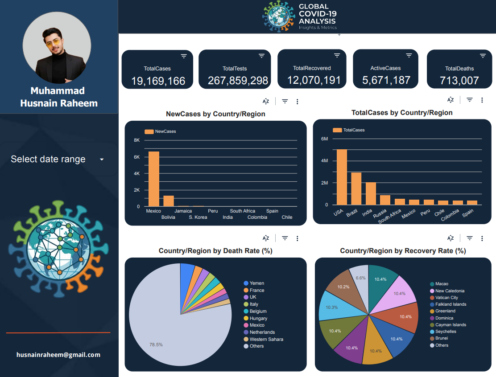
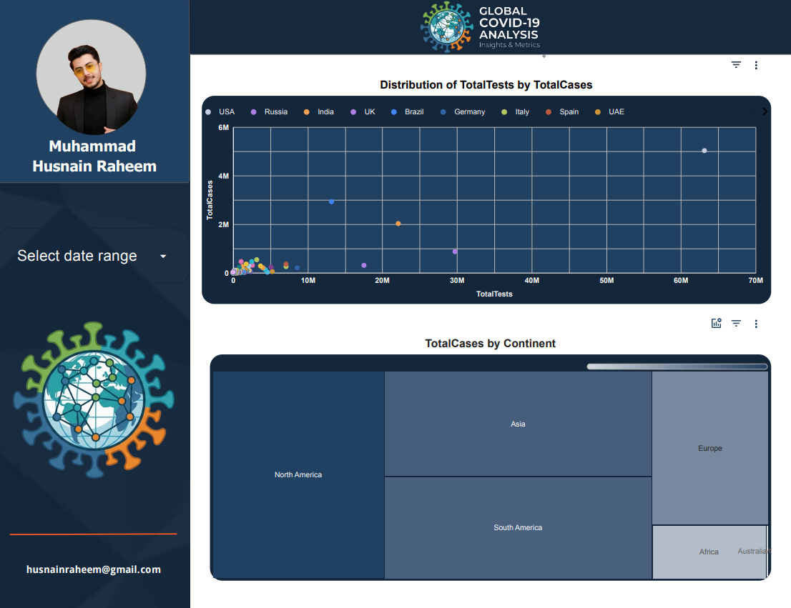
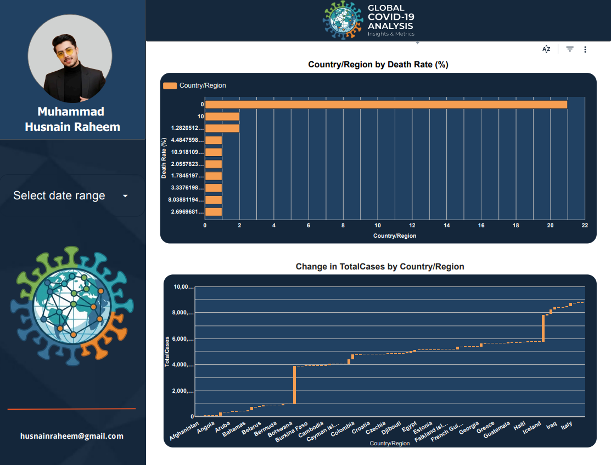

# 🌍 Global COVID-19 Analytics Dashboard

An executive-level Business Intelligence (BI) dashboard developed using **Google Looker Studio** for comprehensive global COVID-19 data analysis. This interactive system provides deep insights into virus transmission, testing metrics, recovery/mortality rates, and regional impacts across the globe.

🔗 **[Click Here to View the Live Dashboard](https://datastudio.google.com/reporting/9b5aa7ea-18ee-4967-9705-6897416ca0c3)**

---

## 📊 Dashboard Visuals & Project Outputs

GitHub par is project ke live outputs aur interface design niche dekha ja sakta hai:

### 📈 Page 1: Global Overview Dashboard
Comprehensive KPI cards showing global summaries, new cases by country, and breakdown of death and recovery rates.

### 🗺️ Page 2: Testing & Regional Distribution
Scatter plot investigating testing vs. infection correlation, alongside a continent-wise distribution treemap.

### 📉 Page 3: Country Data Table
Detailed granular data comparison and regional growth patterns across infected countries.

---

## 🚀 Key Features

- **Executive Overview**: High-level KPI scorecards providing real-time global summaries.
- **Geographic & Regional Breakdown**: Interactive continent-wise distributions and country-level comparisons.
- **Advanced BI Analytics**: Dynamic scatter plots to measure correlations between Testing capacity and Total Cases.
- **Custom Metrics**: Built-in calculated fields for precise Recovery and Death Rate evaluation.
- **Interactive Controls**: Date-range filters, hover tooltips, and click-to-filter visual elements.
- **Modern UI**: Dark-themed navy interface designed for professional corporate reporting.

---

## 🛠️ Tech Stack & Data Architecture

* **BI Tool:** Google Looker Studio
* **Data Sources:** CSV Dataset Upload, Google Sheets Integration (Optional: BigQuery setup)
* **Theme Configuration:** Executive Dark Navy (`#0B1320`), Panel Dark Grey, Accent Orange (`#FF8C00`), White Text.

### Data Schema & Fields
| Field Name | Type | Description |
| :--- | :--- | :--- |
| `Country/Region` | Dimension | Geographic entity identifier |
| `Continent` | Dimension | Continental grouping |
| `TotalCases` / `NewCases` | Metric | Cumulative & newly reported metrics |
| `TotalDeaths` / `TotalRecovered` | Metric | Mortality and Recovery tracks |
| `ActiveCases` / `TotalTests` | Metric | Ongoing active infections and diagnostic testing |

### 📐 Custom Calculated Fields
This dashboard applies custom formulas to normalize raw global metrics:
* **Recovery Rate (%):** `(TotalRecovered / TotalCases) * 100`
* **Death Rate (%):** `(TotalDeaths / TotalCases) * 100`
* **Active Case Ratio (%):** `(ActiveCases / TotalCases) * 100`

---

## ⚙️ Data Preprocessing & Optimization

To ensure seamless report performance, the source data underwent the following optimizations:
1.  **Data Cleaning:** Removal of duplicate rows and formatting of numeric expressions.
2.  **Missing Value Handling:** Standardizing missing records to prevent chart breaks.
3.  **Normalization:** Country name alignment to match Looker Studio's geo-maps.
4.  **Performance Tuning:** Pre-aggregating data metrics to reduce runtime dashboard calculations.

---

## 📂 Project Deliverables Included

- **Fully Functional Looker Studio Report Link**
- **Cleaned & Processed COVID-19 Source Dataset (worldometer_data.csv)**
- **Pre-configured Chart Mappings & Style Formats**

---

## 📝 License

This project is open-source and available under the [MIT License](LICENSE).
